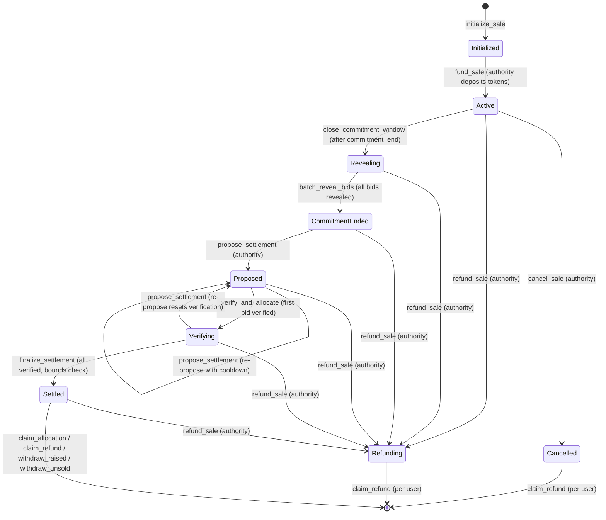

# Fundraising Program — Process Overview

## Auction Lifecycle

The fundraising program implements a **sealed-bid auction** for token sales on Solana. Bids are committed with encrypted max FDV values, revealed after a drand beacon round, and settled at a uniform clearing price.

### States

| # | Status | Description |
|---|--------|-------------|
| 0 | **Initialized** | Sale account created with parameters (FDV range, raise range, timing, merkle root). Vaults created. |
| 1 | **Active** | Authority has funded the token vault. Bidders can commit USDC with encrypted bids. |
| 2 | **Revealing** | Commitment window closed. Crankers reveal bids using the drand signature. |
| 3 | **CommitmentEnded** | All bids revealed. Authority can propose a clearing price. |
| 4 | **Proposed** | Settlement proposed with clearing FDV, fill rate, and optional marginal bidder. |
| 5 | **Verifying** | Crankers verify each bid against the proposed settlement (permissionless). |
| 6 | **Settled** | All bids verified, running sum validated against raise bounds, token vault checked. |
| 7 | **Finalized** | Terminal state (not currently used as a distinct transition — Settled is effectively final). |
| 8 | **Cancelled** | Sale cancelled by authority. Users claim full USDC refunds. |
| 9 | **Refunding** | Authority-triggered refund mode. Users claim full USDC refunds. |

### Flow Diagram

## Key Actors

### Authority
- Creates and funds the sale (`initialize_sale`, `fund_sale`)
- Proposes settlement parameters (`propose_settlement`)
- Controls pause/unpause, claim enabling, cancellation, and refund mode
- Withdraws raised USDC and unsold tokens after settlement

### Bidders
- Commit USDC with an encrypted max FDV bid (`commit`)
- Must provide a valid Merkle proof of their score for whitelisting
- Claim tokens + partial USDC refund after settlement (`claim_allocation`)
- Claim full USDC refund if cancelled/refunding (`claim_refund`)

### Crankers (permissionless)
- Close the commitment window after `commitment_end` (`close_commitment_window`)
- Reveal bids in batches using the drand signature (`batch_reveal_bids`)
- Verify individual allocations against the proposed settlement (`verify_and_allocate`, `batch_verify_and_allocate`)
- Finalize settlement after all verifications pass (`finalize_settlement`)

## Bid Commitment Scheme

1. **Commit phase**: Bidder submits `hash_commitment = SHA256(max_fdv || salt)` along with `max_fdv_encrypted` (drand timelock ciphertext), the salt, and USDC amount.
2. **Reveal phase**: After the drand round, anyone with the drand signature can reveal bids by providing the plaintext `max_fdv`. The program verifies `SHA256(max_fdv || salt) == hash_commitment`.
3. **Settlement**: Authority proposes a `clearing_fdv` and `fill_rate`. Bids above clearing FDV are filled pro-rata; bids at or below are refunded (except the marginal bidder who gets a partial fill).

## drand Integration

The program uses **drand Quicknet** (chain hash prefix `52db9ba7...`) for timelock encryption:

- **Round calculation**: `round = ceil((timestamp - genesis) / period)` where genesis = `1692803367`, period = `3s`
- **Reveal round**: Set at initialization to the round corresponding to `commitment_end`
- **Verification**: The `verify_drand_signature` function checks chain hash and non-trivial signature bytes (see Security Review for limitations)
- **Purpose**: Prevents bid values from being known before the commitment window closes

## Settlement Mechanics

1. **Propose**: Authority submits `clearing_fdv`, `fill_rate` (basis points, 10000 = 100%), optional `marginal_user` and `marginal_allocation`
2. **Verify**: Each bid is checked — bids above clearing FDV get `allocation = amount * fill_rate / 10000`, tokens = `allocation * token_supply / clearing_fdv`. Bids at/below get full refund.
3. **Finalize**: Checks `verification_count == total_users`, `raise_min <= running_sum <= raise_max`, and sufficient tokens in vault.
4. **Re-proposal**: If verification reveals issues, authority can re-propose (with cooldown), which resets all verification state.
